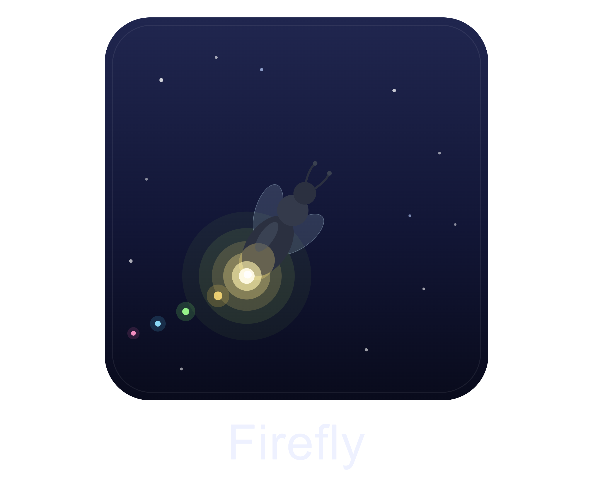

<p align="center">
  
</p>

# Firefly

[](https://github.com/GooberCraft/Firefly/actions)
[](https://www.codefactor.io/repository/github/goobercraft/firefly)
[](https://github.com/GooberCraft/Firefly/releases)
[](https://bstats.org/plugin/bukkit/Firefly/31993)

Firefly gives players control over the **locator bar** — the on-screen bar added in Minecraft
1.21.6+ that shows other players' positions as colored dots/waypoints. Players can hide their own
dot from everyone else and recolor it; admins can bypass hiding to see everyone, list who is
currently hidden, and configure the default behavior.

Firefly works entirely by intercepting the server→client `WAYPOINT` packet through
[packetevents](https://github.com/retrooper/packetevents) — there is no Bukkit API for per-viewer
locator control, so packetevents is a hard dependency.

## Requirements

- A **Paper, Spigot, or Folia 1.21.6+** server (the locator bar exists from 1.21.6 onward; Firefly
  also targets the Minecraft 26.1 waypoint update). Folia is fully supported.
- The **[packetevents](https://www.spigotmc.org/resources/packetevents.80279/)** plugin installed in
  `plugins/`. Firefly will refuse to enable without it.
- Clients on 1.21.6+ to actually render the locator bar.

## Installation

1. Install the **packetevents** plugin in your server's `plugins/` folder.
2. Drop `Firefly-1.0.jar` (from `target/` after building) into `plugins/`.
3. Start the server. Firefly creates `plugins/Firefly/config.yml`, `messages.yml` (and `playerdata.yml`
   when using the default YAML storage). It works out of the box — no configuration required.

## Commands

Base command: `/firefly` (alias `/ff`).

| Command | Permission | Description |
| --- | --- | --- |
| `/firefly hide` | `firefly.use` | Hide your dot from other players' locator bars. |
| `/firefly show` | `firefly.use` | Show your dot again. |
| `/firefly toggle` | `firefly.use` | Flip your hidden state. |
| `/firefly color <name\|#RRGGBB>` | `firefly.use` | Set the color of your dot as others see it. |
| `/firefly color reset` | `firefly.use` | Reset your dot to the vanilla color. |
| `/firefly bypass <on\|off\|toggle>` | `firefly.admin` | See-all: reveal players who have hidden their dot. |
| `/firefly showhidden` | `firefly.admin` | List players who currently have their dot hidden. |
| `/firefly reload` | `firefly.admin` | Reload `config.yml` and re-read player data from the active storage backend. |

### Colors

`/firefly color` accepts either one of the sixteen Minecraft color names (tab-completed) or a
`#RRGGBB` hex code for any RGB color:

```
/ff color aqua
/ff color #FF8800
/ff color reset
```

Named colors: `black`, `dark_blue`, `dark_green`, `dark_aqua`, `dark_red`, `dark_purple`, `gold`,
`gray`, `dark_gray`, `blue`, `green`, `aqua`, `red`, `light_purple`, `yellow`, `white`.

## Permissions

| Permission | Default | Grants |
| --- | --- | --- |
| `firefly.use` | everyone | Hide/show/toggle and recolor your own dot. |
| `firefly.admin` | ops | Bypass hiding, list hidden players, reload. |

## Configuration

`plugins/Firefly/config.yml`:

```yaml
admin-bypass:
  # When an admin (firefly.admin) joins, should "see-all" bypass start enabled?
  #   false - admins respect player hiding until they opt in (recommended)
  #   true  - admins see everyone by default
  default: false
```

`admin-bypass.default` only applies to admins who have never run `/firefly bypass` — an admin's
explicit choice is **persisted** and wins on every future login. When an admin logs in with bypass
active, Firefly reminds them (with a hint to `/firefly bypass off`).

### Storage

Hide state, colors, and each admin's bypass choice are persisted per player UUID and survive relogs
and restarts. Choose the backend in `config.yml`:

```yaml
storage:
  type: yaml          # yaml (default) | h2 | mysql
  h2:
    file: players     # embedded SQL DB at plugins/Firefly/players.mv.db
  mysql:
    host: localhost
    port: 3306
    database: firefly
    username: firefly
    password: ""      # literal, or ${ENV_VAR} to read from the environment (recommended)
    ssl: preferred    # disabled | preferred | required | verify-ca | verify-identity
    pool:                 # one background thread does all DB I/O, so a tiny fixed pool is optimal
      maximum-pool-size: 2
      minimum-idle: 2
      connection-timeout-ms: 10000
      max-lifetime-ms: 1800000
      keepalive-ms: 0
```

- **yaml** — flat `playerdata.yml`, zero setup.
- **h2** — embedded, file-based SQL (no external server). Runs in MySQL-compatibility mode.
- **mysql** — external server, pooled with HikariCP; share preferences across a network of servers.

All database I/O runs on a dedicated background thread (never the main thread). Switching backends
**does not migrate** existing data. If a database can't be reached, Firefly logs the error and falls
back to YAML so the plugin still works. The H2/MySQL/HikariCP drivers are shaded into the jar
(~+10 MB).

**Security notes:** all queries are parameterized; the H2 file name is sanitized (no URL-injection);
MySQL connects with TLS per `ssl`, `allowPublicKeyRetrieval=false`, and prepared-statement caching;
keep the password in an environment variable via `${ENV_VAR}`; and grant the MySQL user only
`SELECT/INSERT/UPDATE/DELETE` on `firefly_players` (plus `CREATE` once, or pre-create the table).

#### Pre-creating the table (least-privilege)

Firefly creates the table automatically (`CREATE TABLE IF NOT EXISTS`). If the database user isn't
allowed to create tables, run [`schema.sql`](src/main/resources/schema.sql) yourself first — it's
the exact DDL the plugin uses (portable across MySQL and H2):

```sql
CREATE TABLE IF NOT EXISTS firefly_players (
    uuid   VARCHAR(36) PRIMARY KEY,
    hidden BOOLEAN     NOT NULL DEFAULT FALSE,
    color  INT         NULL,
    bypass BOOLEAN     NULL
);
```

Then grant only what's needed:

```sql
GRANT SELECT, INSERT, UPDATE, DELETE ON firefly.firefly_players TO 'firefly'@'%';
```

The only access patterns are primary-key lookups on `uuid` (upsert/delete) and a full read at
startup, so the `uuid` primary key is the only index needed — no secondary indexes.

### Messages / localization

Every message the plugin sends is customizable and translatable in `plugins/Firefly/messages.yml`.
Edit the text, color with legacy `&` codes (`&a`, `&l`, `&r`, …), and reload with `/firefly reload`.
Keys you don't change fall back to the built-in English defaults, so the file never breaks across
updates. Placeholders like `{prefix}`, `{color}`, `{player}`, and `{count}` are filled in by the
plugin (documented inline in the file).

## How it works

The locator bar is driven by one `WAYPOINT` packet per tracked player, with `TRACK` / `UPDATE` /
`UNTRACK` operations keyed by the transmitter's UUID. Firefly's
[`WaypointManager`](src/main/java/com/mdwgames/firefly/locator/WaypointManager.java):

- **Hides** a dot by cancelling its `TRACK`/`UPDATE` (or rewriting it to `UNTRACK` if already shown),
  when the transmitter is hidden and the receiver isn't bypassing.
- **Recolors** a visible dot by rebuilding its waypoint with a new icon color.
- **Reconciles actively**: toggling hide/color or bypass produces no vanilla packets, so the manager
  caches each waypoint's last payload and pushes a surgical `UNTRACK`/`TRACK`/`UPDATE` the moment a
  preference changes — no waiting for the player to move out of range.

Packet interception runs on netty I/O threads (read-only against concurrent state); all packet
*sends* and reconciliation run on a single scheduler thread via packetevents' cross-platform
`FoliaScheduler` — the global region scheduler on **Folia**, the main thread on Paper/Spigot. Because
Firefly only ever touches player UUIDs, the in-memory store, cached payloads, and packet sends (never
region-locked world or entity state), it runs safely on Folia.

## Building

```bash
mvn clean verify
```

Compiles, runs the test suite (JUnit 6 + Mockito + MockBukkit), enforces the JaCoCo coverage gate,
and produces `target/Firefly-1.0.jar`. packetevents and the Paper API are `provided` (not bundled);
HikariCP, H2, and the MySQL driver are shaded in and relocated under `com.mdwgames.firefly.lib.*`.

## Project layout

```
src/main/java/com/mdwgames/firefly/
  Firefly.java                         plugin entry point / wiring
  command/FireflyCommand.java          /firefly executor + tab completion
  data/PlayerPreferences.java          immutable snapshot (hidden, color, tri-state bypass)
  data/PreferenceStore.java            in-memory state; delegates persistence to a Storage backend
  data/storage/Storage.java            persistence interface
  data/storage/YamlStorage.java        flat-file backend (default)
  data/storage/SqlStorage.java         HikariCP + JDBC backend (H2 / MySQL)
  data/storage/FallbackStorage.java    falls back to YAML if the database can't be reached
  data/storage/StorageFactory.java     builds the configured backend from config.yml
  listener/PlayerSessionListener.java  seeds bypass on join (+ login reminder), cleans up on quit
  locator/WaypointManager.java         packetevents listener — the core
  util/ColorNames.java                 named-color / hex parsing
src/main/resources/
  plugin.yml, config.yml, schema.sql   descriptor, default config, SQL table DDL
src/test/java/com/mdwgames/firefly/    tests mirror the production packages
```
